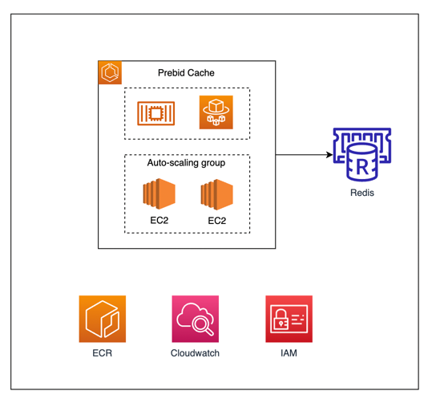

# Prebid Cache Infra

## What does this module do?
Terraform module designed to create and AWS ECS cluster required for hosting the [prebid-cache](https://github.com/prebid/prebid-cache) docker image and the Redis cluster for the in-memory database backend.
It also creates all the required security settings to allow incoming request from an application load balancer and enable communication between the prebid-server and the prebid-cache server.

## Pre-requisites
This module does not create a VPC for the resources to be deployed nor does it create the load balancer sending the traffic to the prebid-cache application.
Therefore, it is a pre-requisite for a `VPC with its subnet groups` and an `application load balancer` to be created prior.

## Usage
**Important**: This module only builds the infrastructure required to host the prebid-cache server and does not build the prebid-cache docker image itself. To see an example of how to build the docker image itself, see instructions in examples/complete

## Examples
For a complete example, see examples/complete.

<!-- BEGIN_TF_DOCS -->
## Requirements

| Name | Version   |
|------|-----------|
|  [terraform](#requirement\_terraform) | \>= 1.3.1 |
|  [aws](#requirement\_aws) | \>= 3.0   |

## Modules

| Name | Source | Version |
|------|--------|---------|
|  [cloudwatch](#module\_cloudwatch) | ./modules/cloudwatch | n/a |
|  [ecr](#module\_ecr) | ./modules/ecr | n/a |
|  [ecs](#module\_ecs) | ./modules/ecs | n/a |
|  [iam](#module\_iam) | ./modules/iam | n/a |
|  [redis](#module\_redis) | ./modules/redis | n/a |
|  [security\_groups](#module\_security\_groups) | ./modules/security_groups | n/a |

## Inputs

| Name | Description | Type | Default | Required |
|------|-------------|------|---------|:--------:|
|  [config](#input\_config) | Configuration object containing environment name, region name and the project name | <pre>object({     environment = string     region      = string     projectName = string   })</pre> | n/a | yes |
|  [ec2\_instance\_type](#input\_ec2\_instance\_type) | EC2 instance type the prebid cache application will be running on | `string` | `"t2.micro"` | no |
|  [lb\_target\_group\_arn](#input\_lb\_target\_group\_arn) | ARN of the load balancer target group | `string` | n/a | yes |
|  [redis\_engine\_version](#input\_redis\_engine\_version) | Redis engine version number | `string` | `"6.2"` | no |
|  [redis\_node\_type](#input\_redis\_node\_type) | Redis node type | `string` | `"cache.t2.small"` | no |
|  [redis\_parameter\_group\_name](#input\_redis\_parameter\_group\_name) | Redis parameter group name. Should be aligned with the redis engine version | `string` | `"default.redis6.x"` | no |
|  [subnets](#input\_subnets) | List of subnet IDs associated with the VPC | `list(string)` | n/a | yes |
|  [tags](#input\_tags) | A map of tags to add to all resources | `map(string)` | <pre>{   "project": "prebid-cache" }</pre> | no |
|  [vpc\_id](#input\_vpc\_id) | Id of the VPC where resources should be deployed | `string` | n/a | yes |

<!-- END_TF_DOCS -->